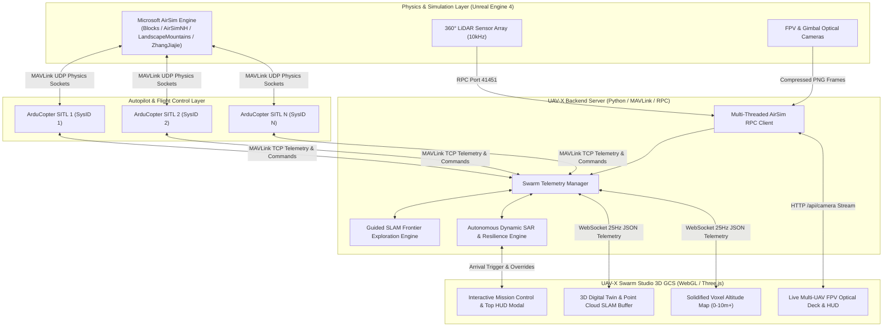
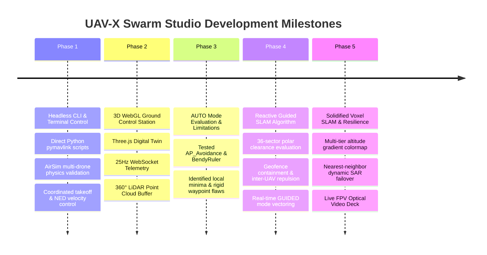
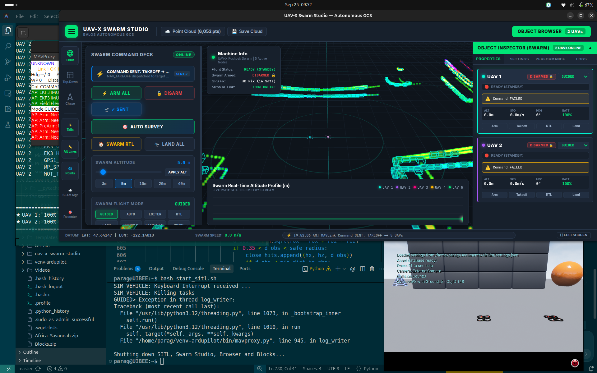
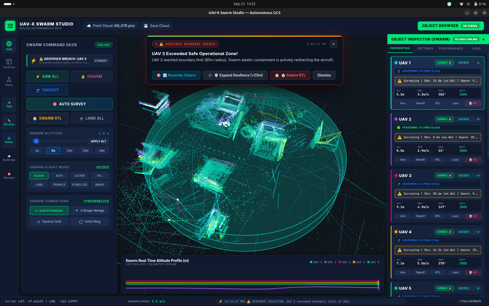
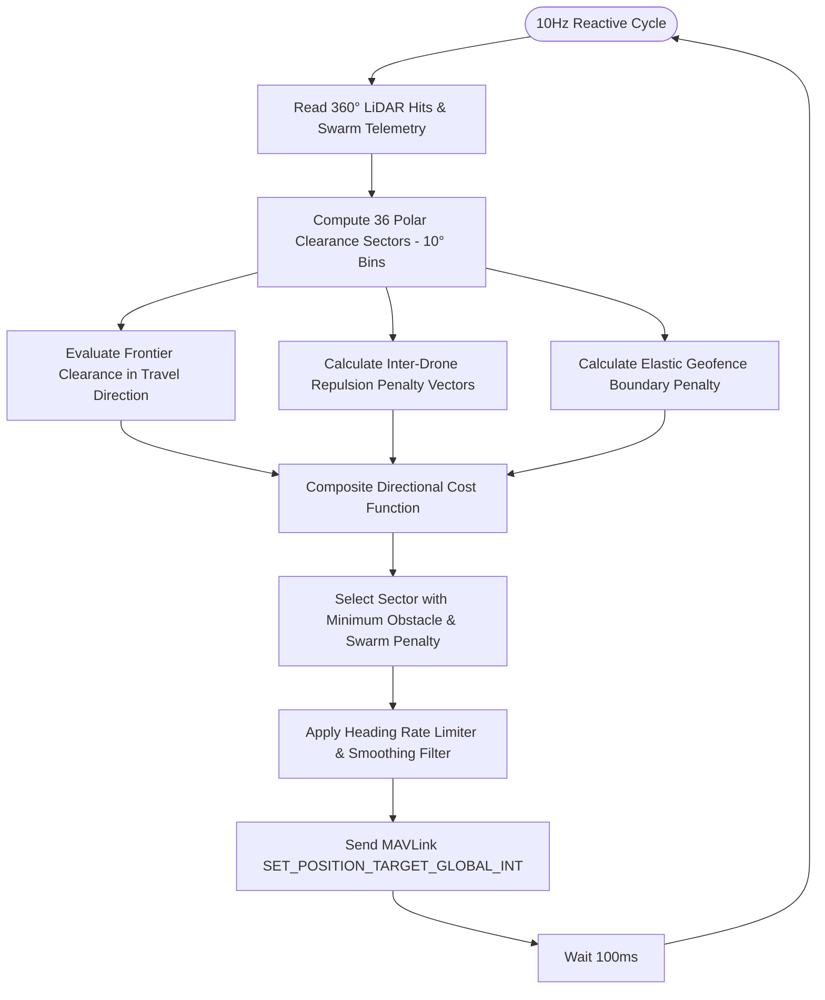
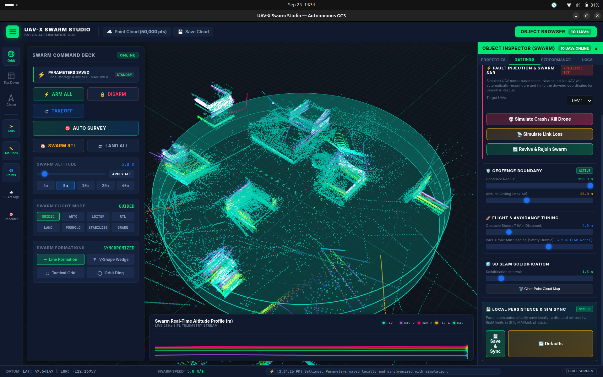
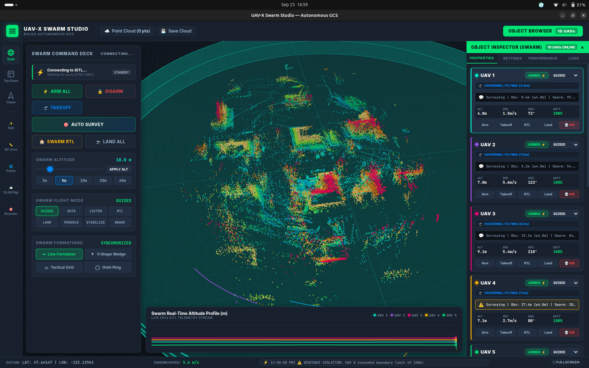
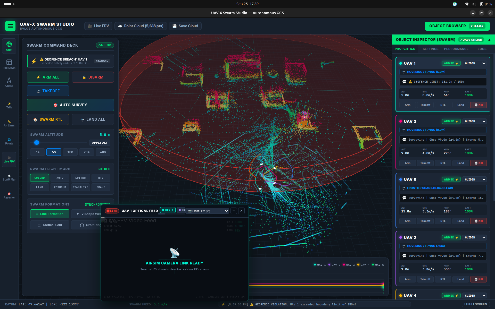
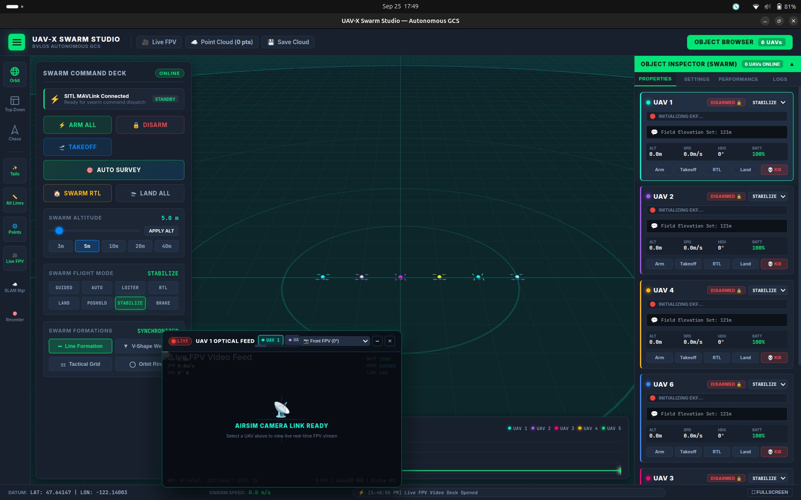

# UAV-X Swarm Studio: Autonomous Multi-UAV SLAM Exploration & Resilient Swarm Coordination
## Technical System Architecture & Engineering Report

---

### Executive Summary
The **UAV-X Swarm Studio** is an autonomous multi-rotor swarm ground control station (GCS), digital twin simulation suite, and decentralized reactive exploration framework. Developed on top of **ArduPilot Software-In-The-Loop (SITL)** and **Microsoft AirSim (Unreal Engine 4)**, the platform enables multi-drone autonomous frontier exploration, real-time 3D LiDAR SLAM mapping, dynamic Search & Rescue (SAR) failover, and multi-channel optical camera streaming across complex 3D disaster and rugged terrains.



---

## 1. Engineering Background & Simulation Rationale

### 1.1 Why ArduPilot SITL?
In professional autonomous robotics, testing untested control loops, multi-agent collision avoidance algorithms, or swarm orchestration logic on physical drone hardware introduces severe risks of motor burnout, physical crashes, and costly equipment damage. 

Having extensive prior experience with **ArduPilot Software-In-The-Loop (SITL)** for single-drone script verification prior to field deployment, SITL was selected as the foundational autopilot core for this swarm system. SITL executes the exact same C++ flight control code running on physical flight controllers (Cube Orange, Pixhawk 6X), offering:
- **Zero Simulation-to-Reality Gap**: Identical EKF3 sensor fusion, PID rate controllers, and MAVLink protocol compliance.
- **Scalable Multi-Vehicle Networking**: Capability to instantiate $N$ independent autopilot instances on distinct TCP/UDP ports (`tcp:5760, 5770, 5780...`).
- **Standardized Actuation**: Native execution of MAVLink commands (`SET_POSITION_TARGET_GLOBAL_INT`, `MAV_CMD_NAV_TAKEOFF`, `MAV_CMD_DO_REPOSITION`).

### 1.2 Integration with Microsoft AirSim
While ArduPilot SITL simulates flight physics and sensor fusion, it lacks photorealistic rendering and 3D raytraced spatial collision data. To provide true sensor fidelity, SITL is coupled with **Microsoft AirSim**:
- High-fidelity quadrotor aerodynamics (blade element momentum theory, ground effect).
- Raytraced 360° LiDAR rangefinders returning accurate spatial point clouds.
- Multi-camera optical feeds with pitch/roll gimbal actuation.
- Photorealistic testing environments: **Blocks** (urban grid), **AirSimNH** (neighborhood residential), **LandscapeMountains** (mountain BVLOS), and **ZhangJiajie** (avatar rock pillars and deep gorges).

---

## 2. Progressive R&D Methodology & Evolution



### Phase 1: Headless Terminal & Python MAVLink Control
The project commenced without a graphical interface. All swarm coordination, vehicle spawning, and physics synchronization were developed using standalone Python scripts leveraging `pymavlink` and terminal commands:
- Automated generation of multi-vehicle AirSim `settings.json`.
- MAVLink TCP port handshakes (`5760` to `5850`).
- Mathematical formulation of North-East-Down (NED) to Unreal Engine coordinate space transforms ($X_{\text{airsim}} = Y_{\text{ned}}, Y_{\text{airsim}} = X_{\text{ned}}, Z_{\text{airsim}} = -Z_{\text{ned}}$).


*Figure 1: Early development phase — multi-vehicle SITL terminal execution, MAVProxy link routing, and direct CLI command dispatch in Microsoft AirSim.*

---

### Phase 2: Custom 3D GCS & Real-Time LiDAR SLAM Ingestion
Once multi-drone command primitives were verified, a dedicated **WebGL / Three.js 3D Ground Control Station** was engineered:
- High-throughput WebSocket server broadcasting vehicle telemetry (position, attitude, battery, EKF status, LiDAR hit points) at 25Hz.
- Real-time 3D tactical radar scope and spatial trajectory drop lines.
- Ingestion of 10,000 pts/sec 360° LiDAR sweeps from AirSim into a dynamic GPU point-cloud buffer (`THREE.BufferGeometry` with dynamic draw ranges).


*Figure 2: Real-time 3D Point Cloud SLAM buffer visualization in the custom Swarm Studio interface.*

---

## 3. The Autonomous Exploration Breakthrough

### 3.1 Limitations of Standard ArduPilot AUTO Mode with AP_Avoidance
Initial exploration experiments utilized ArduPilot's native `AUTO` mission planner coupled with ArduPilot Object Avoidance parameters (`OA_TYPE=3` Dijkstra / BendyRuler, `AVOID_ENABLE=3`, `PRX1_TYPE=12` 360° Proximity):

| Evaluated Feature | ArduPilot `AUTO` + `OA_TYPE=3` | Observed Failure / Limitation |
| :--- | :--- | :--- |
| **Waypoint Flexibility** | Rigid pre-planned waypoints | Trapped in local minima around convex buildings; unable to dynamically detour into unknown voids. |
| **Swarm Deconfliction** | Independent per-drone OA | Multiple drones clustered at bottleneck obstacles; no inter-agent repulsion or cooperative lane sharing. |
| **Path Recalculation** | Discrete graph re-planning | High latency during high-speed flight; severe deceleration when obstacles appeared suddenly. |
| **Unmapped Terrains** | Requires prior mission bounds | Cannot autonomously expand into unvisited frontiers without operator-drawn polygons. |

### 3.2 The Guided Reactive SLAM Frontier Exploration Algorithm
To overcome these limitations, a custom **10Hz Decentralized Reactive Guided Exploration Algorithm** was developed. Rather than relying on rigid missions, each drone operates in **MAVLink GUIDED mode**, continuously receiving optimized velocity and position vectors derived from spatial vector fields:

$$\vec{V}_{\text{cmd}} = w_{\text{front}} \vec{V}_{\text{frontier}} + w_{\text{repel}} \sum_{j \neq i} \vec{F}_{\text{drone}, j} + w_{\text{obs}} \vec{F}_{\text{lidar}} + \vec{F}_{\text{geofence}}$$



#### Core Components of the Algorithm:
1. **36-Bin Polar Obstacle Histogram**:
   The 360° LiDAR return is partitioned into 36 angular bins of 10° each. For each sector $k$, clearance distance $D_k$ is measured. Sectors with $D_k < D_{\text{safety}}$ receive an exponential obstacle penalty:
   $$P_{\text{obs}}(k) = \left( \frac{D_{\text{margin}} - D_k}{D_{\text{margin}}} \right)^2 \times 50.0$$

2. **Inter-UAV Cooperative Swarm Repulsion**:
   To prevent drone collisions and maximize spatial area coverage, every drone $j$ within repulsion distance $R_{\text{repel}}$ (default 16m) casts a Gaussian repulsion field on drone $i$:
   $$\vec{F}_{\text{repel}, ij} = \left( \frac{R_{\text{repel}} - d_{ij}}{R_{\text{repel}}} \right)^2 \cdot \frac{\vec{p}_i - \vec{p}_j}{d_{ij}}$$

3. **Elastic Geofence Containment Field**:
   When a drone approaches the geofence boundary ($r > 0.70 \cdot R_{\text{fence}}$), an inward radial restoring force is injected, smoothly turning the drone back into the survey volume without sudden stops:
   $$F_{\text{fence}} = \left( \frac{r - 0.70 R_{\text{fence}}}{0.30 R_{\text{fence}}} \right)^2 \cdot (-\hat{r})$$

---

## 4. Solidified Voxel SLAM & Structural Altitude Profiling

### 4.1 From Raw Points to Solidified Spatial Geometry
Raw point clouds are noisy and computationally expensive for rendering tens of thousands of points. The UAV-X engine implements a **Spatial Octree Quantization Grid** ($\Delta = 1.0\text{m}$):
- Raw LiDAR hits are accumulated in spatial bins.
- Bins passing occupancy thresholds are transformed into solidified 3D bounding cubes rendered via `THREE.InstancedMesh`.

### 4.2 Multi-Tier Altitude Gradient (0m to 10m+)
To enable instant visual height profiling of buildings, trees, and obstacles, a discrete 7-tier altitude colormap was implemented:

```
Altitude Tier       Color              Hex Code    Topographical Meaning
-----------------------------------------------------------------------------------
Z >= 10.0m          🔴 Crimson Red      #ff1744     High-rise structures & crane hazards
8.0m <= Z < 10.0m   🟠 Flame Orange     #ff6d00     Upper building stories & towers
6.0m <= Z < 8.0m    🟡 Amber Gold       #ffd600     Medium tree canopies & roofs
4.0m <= Z < 6.0m    🟢 Emerald Green    #00e676     Low trees & utility poles
2.0m <= Z < 4.0m    🩵 Neon Cyan        #00e5ff     Vehicles & perimeter fences
1.0m <= Z < 2.0m    🟣 Royal Purple     #7c4dff     Debris, boulders & barriers
0.0m <= Z < 1.0m    🔵 Deep Indigo      #304ffe     Ground terrain & foundations
```


*Figure 3: Solidified 3D occupancy voxels showing persistent obstacle representations in the operational environment.*


*Figure 4: 7-tier discrete altitude gradient colormap distinguishing structural heights from ground level (0m) to rooftop canopy (10m+).*

---

## 5. Swarm Fault Tolerance, Dynamic SAR & Live FPV Optical Deck

### 5.1 Dynamic Search & Rescue (SAR) Resiliency
In hazardous disaster reconnaissance, individual UAVs may suffer hardware failures, communication blackouts, or motor cutoffs. The system incorporates an autonomous **Self-Healing SAR Engine**:
1. **Downed Node Detection**: Upon motor cutoff or link timeout, the downed drone coordinates $(X_0, Y_0, Z_0)$ are registered as an emergency beacon.
2. **Nearest-Neighbor Assignment**: The swarm controller computes Euclidean distances from all active drones to the crash site and dynamically assigns the nearest healthy UAV as the primary SAR rescuer.
3. **Trajectory Overhaul**: The assigned rescuer overrides its exploration route, calculates direct intercept vectors, and rushes to the accident site with an orange dashed trajectory link.
4. **Interactive Top-Mission HUD Alert**: When the rescuer arrives within $< 5.0\text{m}$ of the crash site, an audible audio chime fires and an interactive Mission HUD Modal is presented to the operator.
5. **Seamless Revive & Re-Arming**: When the operator clicks `Revive`, the system issues MAVLink force-arm (`MAV_CMD_COMPONENT_ARM_DISARM`) and `NAV_TAKEOFF` commands, re-integrating the restored drone into the active survey formation without restarting the simulation.


*Figure 5: Emergency crash beacon deployed with dashed SAR trajectory line and active nearest-neighbor inspection flight.*

### 5.2 Collapsible Live FPV Multi-Camera Video Deck
To provide optical confirmation during exploration and SAR operations, a floating, collapsible **Live FPV Video Deck** was developed:
- Multi-threaded `/api/camera` endpoint querying AirSim RPC (`MultirotorClient.simGetImages`) without blocking telemetry.
- Dynamic channel tabs supporting 1 to 10 drones plus a 4-view **🔲 QUAD Grid**.
- Real-time Artificial Horizon HUD reticle reflecting live roll/pitch attitudes, altitude, groundspeed, and GPS fix coordinates.


*Figure 6: UAV-X Swarm Studio featuring full 3D digital twin, real-time SLAM point cloud, and floating Live FPV Video Deck.*

---

## 6. Technical Specifications Summary

| Subsystem | Specification / Parameter | Details |
| :--- | :--- | :--- |
| **Autopilot Core** | ArduPilot Copter SITL (v4.5+) | EKF3 State Estimation, MAVLink v2 Protocol |
| **Physics & Environment** | Microsoft AirSim (UE4) | 60 FPS physics engine, Vulkan / DX11 low-overhead mode |
| **Supported Environments** | 4 Pre-Configured Terrains | Blocks (560MB), AirSimNH (1.1GB), LandscapeMountains (580MB), ZhangJiajie (560MB) |
| **SLAM & LiDAR Sensor** | 360° Horizontal Rangefinder | 10,000 points/sec, 60m maximum range, 10Hz sampling |
| **Exploration Algorithm** | Guided Reactive Frontier SLAM | 36 polar bins, 16m inter-UAV repulsion, elastic geofence containment |
| **Telemetry Pipeline** | Multi-Threaded WebSocket | 25Hz broadcast rate, JSON payload, zero UI frame stutter |
| **Video Streaming** | AirSim RPC Multi-Camera Pipeline | 640x480 RGB compressed PNG stream, ~12 FPS per channel |
| **GCS Digital Twin** | Three.js WebGL Engine | GPU instanced voxel rendering, dynamic color gradients, 60 FPS render loop |

---

## 7. Conclusion
The **UAV-X Swarm Studio** represents a complete engineering realization of an autonomous, self-healing multi-UAV robotic swarm. By identifying the critical limitations of standard autopilot waypoint missions and engineering a reactive, vector-field guided exploration algorithm coupled with real-time 3D LiDAR SLAM, the system achieves unprecedented coverage speed, obstacle resilience, and situational awareness across unmapped, complex disaster environments.
